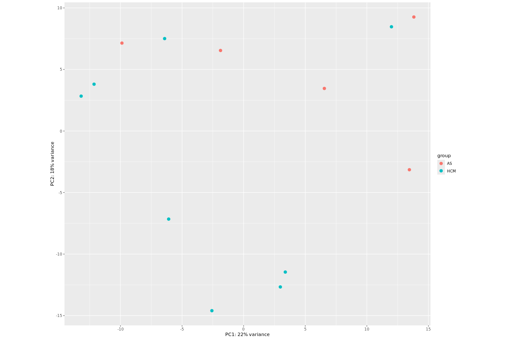
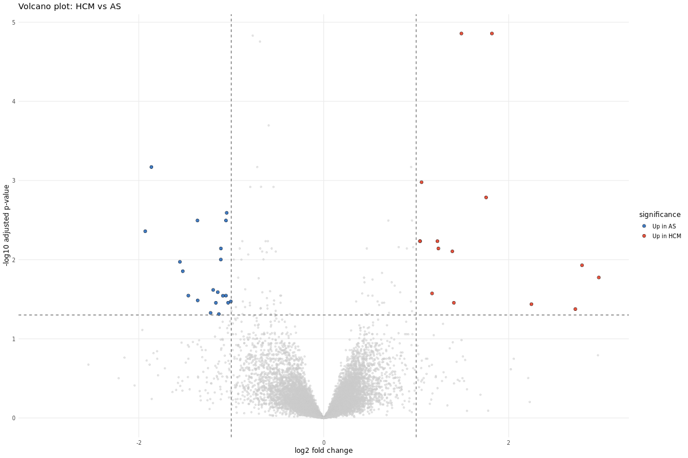
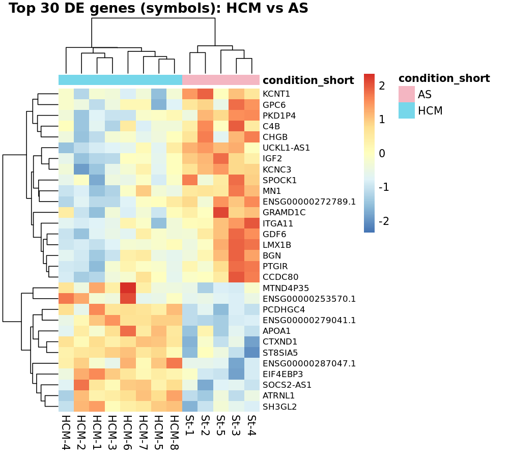
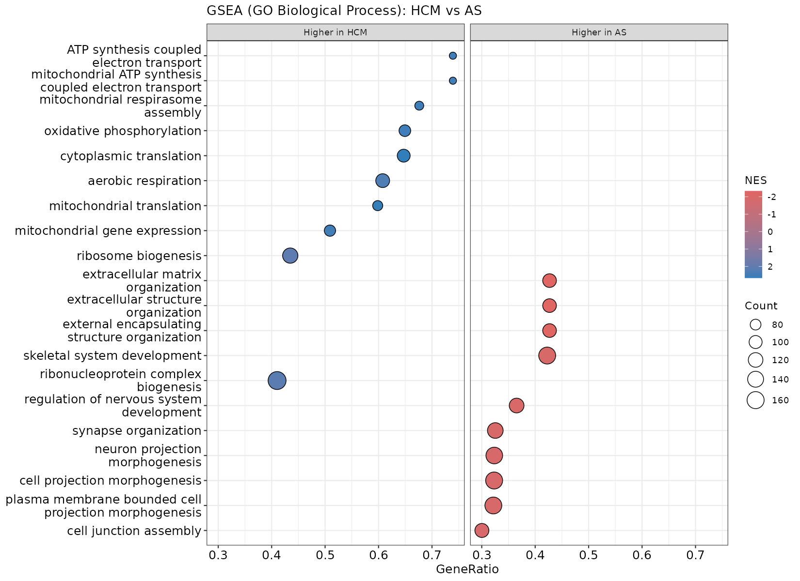

# Bulk RNA-seq analysis of primary versus pressure-overload cardiac hypertrophy in human myocardium

A reproducible bulk RNA-seq reanalysis of human myocardial tissue comparing hypertrophic cardiomyopathy and aortic-stenosis-induced hypertrophy.

## Project overview

This repository contains a focused transcriptomic reanalysis of human cardiac hypertrophy using public bulk RNA-seq data.

The project examines gene-expression differences between two pathological remodeling states in the human heart:

- **hypertrophic cardiomyopathy (HCM)**, representing primary myocardial hypertrophy
- **aortic-stenosis-induced hypertrophy (AS)**, representing secondary hypertrophy caused by chronic pressure overload

The analysis is designed as a compact, interpretable RNA-seq project centered on raw-count-based differential expression, sample-level exploration, and pathway-oriented biological interpretation.

## Research question

**How does hypertrophic cardiomyopathy differ transcriptionally from pressure-overload cardiac hypertrophy in human myocardium?**

## Source study

This project is based on the public dataset [**GSE206978**](https://www.ncbi.nlm.nih.gov/geo/query/acc.cgi?acc=GSE206978), generated in the study:

[**Novel Genes Involved in Hypertrophic Cardiomyopathy: Data of Transcriptome and Methylome Profiling**](https://pmc.ncbi.nlm.nih.gov/articles/PMC9739701/)

The original study compared myocardial samples from patients with **HCM** and **AS** and used both **bulk RNA-seq** and **genome-wide DNA methylation profiling**.

This repository focuses only on the **RNA-seq component** and reanalyzes the public raw count matrix as an independent transcriptomic workflow.

## Biological context

Cardiac hypertrophy is not a single biological entity. Similar tissue-level enlargement can arise through different mechanisms.

In **HCM**, hypertrophy reflects a primary disorder of the myocardium, often linked to intrinsic abnormalities of cardiac muscle structure and function. In **AS**, hypertrophy develops as an adaptive response to long-term pressure overload, because the left ventricle must pump against an obstructed aortic valve.

This makes the HCM-versus-AS comparison biologically informative: both groups show hypertrophied myocardium, but the underlying drivers of remodeling differ. The project therefore focuses on transcriptomic features that distinguish **primary myocardial disease** from **pressure-overload remodeling**.

## Dataset

**Accession:** GSE206978  
**Tissue:** human myocardium  
**Data type:** bulk RNA-seq raw counts  
**Current comparison:** HCM vs AS

### Samples included in the current analysis

| Group | n |
|------|---:|
| HCM | 8 |
| AS | 5 |

## Input data

The analysis uses public GEO files together with a cleaned project-specific sample sheet.

- `data/raw/HCM_vs_stenosis_raw_counts.tsv` — gene-level raw count matrix (60,723 genes × 13 samples, Ensembl IDs)
- `data/raw/Sample_description.tsv` — sample-level metadata from GEO
- `data/raw/sample_metadata.csv` — cleaned, analysis-ready sample table (sample ID, condition, sex, age)

Validated and intermediate objects produced during the pipeline (checked counts, filtered matrix, DESeq2 objects, results tables) are written to `data/processed/`.

## Analytical workflow

The pipeline is organised as a sequence of numbered R scripts in `scripts/`,
each consuming the output of the previous step:

| Step | Script | What it does |
|---|---|---|
| 01 | `01_load_and_validate_input.R` | Load raw counts + metadata, run integrity checks, align metadata to count columns, set `condition` factor (AS as reference) |
| 02 | `02_filter_low_counts.R` | Group-aware filtering of low-count genes (≥10 counts in ≥3 samples of either group) |
| 03 | `03_deseq2_setup_and_sample_qc.R` | Build DESeq2 dataset, size-factor normalization, VST, sample-level QC (library sizes, PCA, sample-distance heatmap) |
| 04 | `04_differential_expression.R` | Differential expression with **DESeq2** (HCM vs AS), result tables, MA plot |
| 05 | `05_de_visualization.R` | Volcano plot of DE results |
| 06 | `06_heatmap_top_de_genes.R` | Heatmap of the top differentially expressed genes |
| 07 | `07_annotate_top_de_genes.R` | Annotate DE genes (Ensembl → symbol + name), split into up-in-HCM / higher-in-AS |
| 08 | `08_enrichment_ora.R` | Over-representation analysis (GO:BP) of the DE gene sets |
| 09 | `09_gsea.R` | Gene Set Enrichment Analysis (GO:BP) over all genes ranked by log2FC |
| 10 | `10_enrichment_plots.R` | Dot-plot visualisation of the GSEA results |

## Environment and how to run

The analysis runs in R (4.4) with Bioconductor packages, managed through a
conda environment defined in `environment.yml` (key packages: **DESeq2**,
**clusterProfiler**, **enrichplot**, **org.Hs.eg.db**, **pheatmap**, **ggplot2**).

```bash
# create and activate the environment
conda env create -f environment.yml
conda activate hcm-vs-as-rnaseq

# run the pipeline in order
Rscript scripts/01_load_and_validate_input.R
Rscript scripts/02_filter_low_counts.R
# ... through to:
Rscript scripts/10_enrichment_plots.R
```

Each script reads from `data/processed/` (and `data/raw/` for step 01) and
writes its outputs to `results/` and `data/processed/`.

## Repository structure

```text
data/
  raw/                 # input count matrix + sample metadata
  processed/           # validated counts, DESeq2 objects, results (.rds)
scripts/               # numbered pipeline scripts 01–10
results/
  figures/             # QC, volcano, heatmap, GSEA dot plot
  tables/              # DE results and enrichment tables
environment.yml        # conda environment definition
```

## Limitations

These should be kept in mind when reading the results below:

- small sample size (8 HCM vs 5 AS)
- a comparison between two **disease** states, not disease versus healthy tissue
- the analysis starts from public processed gene-level counts, not raw FASTQ files
- the DESeq2 design models condition only (`~ condition_short`) and does not adjust for sex or age (available in the metadata); given the small sample, these potential confounders are not modelled
- findings are therefore transcriptomic **associations**, not causal mechanisms

## Results

### 1. Sample-level QC and exploratory analysis

Library sizes were comparable across all 13 samples, and no sample behaved as
a technical outlier. However, principal component analysis did **not** separate
HCM and AS: the two groups overlap across the plot, and the leading components
explain only a modest fraction of the variance (PC1 ≈ 22%, PC2 ≈ 19%). The
sample-to-sample distance heatmap tells the same story — samples do not cluster
cleanly by condition.



This is an informative negative result rather than a failure: both groups are
hypertrophied, diseased myocardium, so their global transcriptomes are similar.
It sets the expectation that any HCM-vs-AS differences will be **subtle and
confined to a limited set of genes**, not a genome-wide shift.

### 2. Differential expression (DESeq2)

Of **16,693** tested genes, **109** were differentially expressed at
`padj < 0.05`, and **35** passed the stricter threshold of
`padj < 0.05 & |log2FoldChange| > 1`. With AS as the reference level, the
results are skewed toward genes that are **higher in AS / lower in HCM**
(67 vs 42 at `padj < 0.05`), consistent with the original study.

Among the top differentially expressed genes, those most relevant to the study's
themes (and not chosen at random) are:

| Higher in AS | Higher in HCM |
|---|---|
| `BGN` — biglycan, extracellular matrix / fibrosis | `MTND4P35` — mitochondrial *MT-ND4* pseudogene |
| `SPOCK1` — proteoglycan, extracellular matrix | `SNAP91` — synaptic vesicle protein |
| `ITGA11` — integrin, cell–matrix adhesion | `GSG1L` — synaptic (AMPA-receptor) |
| `C4B` — complement, immune | |
| `IGF2` — growth factor | |

The AS side has clear, well-characterised markers (matrix, immune, growth). The
HCM side has no comparable single marker — its strongest individual genes are a
mitochondrial pseudogene and neuronal genes, and its main signal is
**collective**, emerging only at the pathway level (see enrichment). The heatmap
confirms these patterns are consistent across samples; the volcano plot
(blue = higher in AS, red = higher in HCM) shows the same overall picture.





### 3. Functional enrichment

**Over-representation analysis (ORA, GO:BP).** Run on the significant gene sets,
ORA found enrichment only on the AS side: genes higher in AS were
over-represented for **cell-substrate adhesion** (e.g. `ITGA11`, `SPOCK1`,
`CCDC80`, `LAMA5`, `FLNA`, `NOTCH1`). The shorter HCM gene list yielded no
significant terms — expected for ORA on a small, scattered set.

**Gene set enrichment analysis (GSEA, GO:BP).** Using all genes ranked by
log2FoldChange (no cutoff), GSEA was far more sensitive and recovered a clear,
interpretable contrast:

- **Higher in HCM:** mitochondrial and energy-related programs —
  *oxidative phosphorylation*, *aerobic respiration*, *ATP synthesis*,
  *mitochondrial translation* — together with *ribosome biogenesis* and
  *cytoplasmic translation* (energy production + protein-synthesis machinery).
- **Higher in AS:** *extracellular matrix organization*, *cell junction
  assembly*, and a cluster of *neuronal / morphogenesis* terms — a structural,
  remodeling-oriented signature.



### 4. Biological interpretation

The two diseases reach a similar end state — thickened, diseased muscle —
through different transcriptional programs:

| | Higher in AS | Higher in HCM |
|---|---|---|
| Dominant program | extracellular matrix / fibrosis | mitochondrial / energetic + protein synthesis |
| Signal character | a few strongly differential genes | many genes shifted slightly |
| Detected by | ORA **and** GSEA | GSEA **only** |

The loud-versus-collective contrast in the last two rows is the practical reason
both enrichment methods were applied: ORA works from a fixed gene list and
captured the AS matrix signal but missed the coordinated HCM energetic shift,
which only GSEA recovered. A neuronal / innervation theme appears on **both**
sides; because bulk RNA-seq mixes cardiomyocytes with nerve fibres and other
cell types, it is interpreted cautiously and may partly reflect tissue
composition.

## Comparison with the original study

This reanalysis uses the **same 8 HCM / 5 AS samples** as the source study, so
the results are directly comparable. In short: **the main findings agree**, this
pipeline is more conservative, and GSEA adds one new signal.

> **Note on direction.** Throughout, differences are described as "higher in AS".
> Because AS is the reference group, this is exactly the same as the original
> study's wording "lower in HCM" — just the other way of saying it.

| | Original study | This reanalysis |
|---|---|---|
| Samples | 8 HCM / 5 AS | 8 HCM / 5 AS |
| DE genes (`padj < 0.05`) | 193 | 109 (more conservative) |
| Most DE genes are | higher in AS | higher in AS ✓ |
| Top theme — AS side | structural / neuronal | structural / neuronal (ECM, adhesion) ✓ |
| Top theme — HCM side | reported as *not* detected | **mitochondrial / energetic** (via GSEA) |

**Key genes reproduced.** `IGF2` and `C4B` (higher in AS) and `CTXND1` and
`EIF4EBP3` (higher in HCM) all came out with the **same direction** as in the
original study — evidence that the pipeline captures real signal, not artefacts.

**A divergence worth noting.** Using over-representation analysis, the original
study **explicitly reported *not* finding** dysregulation of ATP-synthesis /
mitochondrial pathways in HCM, reasoning that these processes are shared between
HCM and AS. Using **GSEA** — a threshold-free, ranked-gene method more sensitive
to subtle, coordinated shifts — this reanalysis instead detected a
**mitochondrial / energetic program relatively elevated in HCM versus AS**. This
divergence is most likely methodological (GSEA captures coordinated changes that
DEG-threshold ORA can miss) and is best read as a hypothesis to revisit, not a
correction of the original conclusion.

## Conclusion

HCM and AS myocardium are globally similar — they do not separate in
unsupervised analysis — but differ in a focused set of genes and pathways
(summarised above). This independent reanalysis reproduces the key genes and the
direction of the published results and, through GSEA, adds an energetic signal in
HCM not reported in the original study. Given the small sample and the
two-disease design, these findings are best read as **transcriptomic
associations** rather than causal mechanisms.